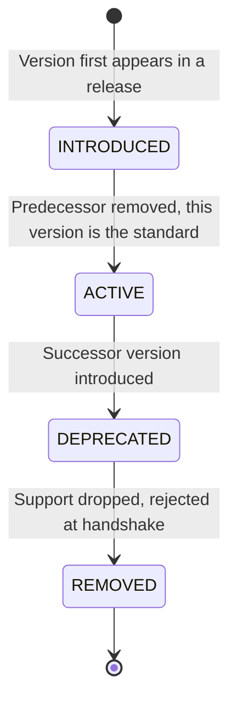

## Simple Summary

Introduce a protocol version digest mechanism that enables nodes to identify compatible peers during network upgrades via the handshake and Hive peer gossip. Additionally, clean up the underlay encoding by using proper protobuf repeated fields instead of custom serialization.

## Abstract

A protocol version digest is a 4-byte identifier derived from the network configuration and current protocol version. By including this digest in both the handshake protocol and Hive peer advertisements, nodes can efficiently filter incompatible peers before connection and avoid gossiping peers that recipients cannot use.

This proposal also replaces the custom underlay serialization format (magic `0x99` prefix with varint-length encoding) with idiomatic protobuf `repeated` fields, simplifying implementations and improving interoperability.

## Motivation

Swarm lacks a standardised mechanism for:

1. **Peer compatibility detection.** Nodes cannot determine protocol compatibility before establishing connections.
2. **Efficient peer gossip.** Hive broadcasts all known peers regardless of protocol compatibility, wasting bandwidth.
3. **Graceful upgrades.** During network upgrades, incompatible nodes waste resources attempting failed connections.
4. **Clean underlay encoding.** The current protocol uses a custom serialization format for multiple underlay addresses: a magic `0x99` prefix byte followed by varint-length-prefixed multiaddr bytes. This deviates from idiomatic protobuf usage, complicates implementations, and conflates wire encoding with application logic.

## Specification

### Protocol Version Digest Calculation

```
protocol_version_digest = keccak256(genesis_hash || current_protocol_version)[0:4]
```

Where:

- `genesis_hash`: 32-byte hash uniquely identifying the network
- `current_protocol_version`: 4-byte version for the active protocol

#### Genesis Hash

The genesis hash MUST uniquely identify a Swarm network. An illustrative example:

```
genesis_hash = keccak256(network_id || genesis_timestamp || ...)
```

The exact composition of the genesis hash requires further discussion. Candidates for inclusion:

- `network_id` (required)
- `genesis_timestamp`
- Contract addresses (postage stamp, staking, redistribution)
- Other network-specific parameters

Feedback is solicited on what should constitute the genesis hash for mainnet and testnet.

### Protocol Versions

| Version | Identifier | Activation |
|---------|------------|------------|
| Homestead | `0x00000000` | Genesis |

### Version Activation Condition

Protocol versions use timestamp-based activation:

```
version_active = current_timestamp >= activation_timestamp
```

### Handshake Integration

The handshake protocol is updated with the protocol version digest and proper underlay encoding:

```protobuf
syntax = "proto3";

package handshake;

message Syn {
    bytes observed_underlay = 1;
}

message Ack {
    BzzAddress address = 1;
    uint64 network_id = 2;
    bool full_node = 3;
    bytes nonce = 4;
    string welcome_message = 99;
}

message SynAck {
    Syn syn = 1;
    Ack ack = 2;
}

message BzzAddress {
    repeated bytes underlays = 1;  // Multiple multiaddr bytes (was: single bytes with custom encoding)
    bytes signature = 2;
    bytes overlay = 3;
    bytes protocol_version_digest = 4;  // 4 bytes
}
```

Key changes:

1. **`underlays` becomes `repeated bytes`** — Each multiaddr is a separate element. No custom serialization (no `0x99` prefix, no varint length encoding). Protobuf handles the wire format.
2. **`protocol_version_digest` is added** — 4-byte protocol version identifier.

Nodes MUST reject connections where `peer.protocol_version_digest != local.protocol_version_digest`.

### Hive Protocol Integration

The Hive protocol uses the same `BzzAddress` message defined above. Gossip filtering rules:

- When receiving peers, ignore those with an incompatible protocol version digest.
- When sending peers, only advertise those matching the recipient's protocol version digest.

This prevents nodes from filling their address books with unreachable peers and reduces unnecessary connection attempts across the network.

### BzzAddress Signature

When the `protocol_version_digest` field is present, the v1 signature scheme (as defined in the BzzAddress Signature Scheme v1 SWIP) MUST be used with the protocol version digest appended:

```
underlays_concat = underlays[0].bytes || underlays[1].bytes || ... || underlays[n].bytes
data = underlays_concat || overlay || network_id || protocol_version_digest
signature = eip191_sign(data)
```

Including the protocol version digest in the signed data binds the signature to a specific protocol version, preventing replay of old addresses on new protocol versions.

### Grace Period

During protocol version transitions (a one-hour window around activation), nodes MAY accept both pre-transition and post-transition digests to accommodate clock skew.

## Rationale

**4-byte digest.** A 4-byte value is compact yet sufficient (2^32 possible values) for network and protocol version disambiguation. This matches Ethereum's approach with fork digests.

**Timestamp activation.** Swarm has no block consensus, making timestamps the natural coordination mechanism.

**Hive integration.** Without version-aware gossip, nodes accumulate stale peer lists during upgrades, degrading connectivity.

**Digest in signature.** Including the protocol version digest in the signature binds the address to a specific protocol version, preventing replay of old addresses after upgrades.

**Repeated bytes for underlays.** The legacy custom encoding (magic `0x99` prefix + varint length prefixes) was a workaround for backward compatibility with single-underlay nodes. This conflates wire encoding with application logic and complicates implementations. Using protobuf's native `repeated bytes` field:

- Leverages protobuf's built-in length-prefixed encoding for wire format
- Simplifies parsing — no custom deserialization logic needed
- Improves interoperability — standard protobuf tooling works correctly
- Separates concerns — wire encoding is handled by protobuf, signature construction is application logic

### Why Two Versions Are Always Sufficient

A critical property of this migration model is that at most two protocol versions ever need to coexist on the network at any point in time. This is sufficient to bridge any upgrade without creating disjoint subnetworks, and it holds because the migration is structured as a sequence of non-overlapping two-phase transitions.

Each protocol upgrade follows the same three-phase lifecycle:

1. **Phase 1 — Introduction (bilingual):** Release N introduces version V+1 alongside version V. All nodes on Release N can communicate with legacy nodes (version V only) and with each other (version V+1). The network remains fully connected because every node speaks at least version V. Version V is **deprecated** at this point — it remains functional but nodes SHOULD upgrade.

2. **Phase 2 — Deprecation notice period:** Between Release N and Release N+1, version V is in a deprecated state. Nodes running Release N log warnings when they encounter V-only peers, giving operators visibility into how much of the network has migrated. This window provides the opportunity for monitoring adoption and ensuring readiness before the final cutover.

3. **Phase 3 — Removal (cutover):** Release N+1 drops support for version V entirely. Nodes still speaking only version V are rejected. The network converges on version V+1 exclusively. Version V is now **removed** — not merely unsupported, but actively rejected at the handshake level.

The key invariant is: **a new protocol version is never introduced until the previous migration has completed.** This means the version space at any moment is either {V} (stable), {V, V+1} (mid-migration, V deprecated), or {V+1} (stable, V removed) — never {V, V+1, V+2}. Because Release N nodes bridge between V and V+1, there is always a connected path between any two nodes on the network during migration. No subset of nodes becomes isolated.

The full lifecycle of a protocol version is:



- **INTRODUCED:** The version first appears in a release, coexisting with its predecessor.
- **ACTIVE:** The version is the current standard. All nodes are expected to support it.
- **DEPRECATED:** A successor version has been introduced. The version still functions but nodes SHOULD migrate. Nodes log warnings when encountering peers on the deprecated version.
- **REMOVED:** Support is dropped. Nodes on this version are rejected at the handshake.

The migration timeline across successive releases:

```mermaid
gantt
    title Protocol Version Migration Timeline
    dateFormat X
    axisFormat %s

    section Version V
    ACTIVE                     :active, v0a, 0, 1
    DEPRECATED                 :crit, v0d, 1, 2
    REMOVED                    :done, v0r, 2, 3

    section Version V+1
    INTRODUCED/ACTIVE          :active, v1i, 1, 2
    ACTIVE                     :active, v1a, 2, 3
    DEPRECATED                 :crit, v1d, 3, 4
    REMOVED                    :done, v1r, 4, 5

    section Version V+2
    INTRODUCED/ACTIVE          :active, v2i, 3, 4
    ACTIVE                     :active, v2a, 4, 5

    section Releases
    Release N (speaks V, V+1)       :milestone, m0, 1, 1
    Release N+1 (speaks V+1 only)   :milestone, m1, 2, 2
    Release N+2 (speaks V+1, V+2)   :milestone, m2, 3, 3
    Release N+3 (speaks V+2 only)   :milestone, m3, 4, 4
```



**Why this prevents disjoint networks:**

- During the {V, V+1} coexistence window, Release N nodes act as bridges. They accept connections from V-only nodes and V+1 nodes alike. Any V-only node can reach any V+1 node through a Release N intermediary.
- The Hive gossip protocol reinforces this: Release N nodes advertise V-only peers to V-only nodes and V+1 peers to V+1 nodes, but they themselves are reachable by both. The address book of every node remains populated with reachable peers.
- The grace period around activation timestamps further smooths the transition, ensuring that minor clock differences between nodes do not cause premature rejection.

**What happens if a node skips an upgrade?** A node still on version V when Release N+1 lands (V+1 only) will be unable to connect. This is by design — the two-release window provides ample time for operators to upgrade. The network does not partition; the stale node simply drops off. This is analogous to Ethereum's approach where nodes that miss a hard fork end up on a dead chain rather than creating a competing subnetwork.

**Constraint on upgrade cadence:** This model requires that Release N+1 is not issued until Release N has achieved sufficient adoption. In practice, this means the upgrade schedule must allow enough time between Release N and Release N+1 for the vast majority of nodes to upgrade. The protocol itself does not enforce this — it is an operational requirement on the release process.

## Backwards Compatibility

This proposal introduces breaking changes to the handshake and Hive protocols:

1. **Protocol version digest field** — New required field in BzzAddress
2. **Underlay encoding** — Changes from `bytes underlay` (custom encoding) to `repeated bytes underlays` (native protobuf)

Migration follows the two-release plan described above:

1. **Release N (introduction — legacy format deprecated).** Protocol version digest is optional. BzzAddress accepts both:
   - Legacy format: `bytes underlay` with custom encoding, no digest — **DEPRECATED**
   - New format: `repeated bytes underlays` with protocol version digest — **ACTIVE**
   Nodes generate the new format but accept both. Nodes SHOULD log warnings when encountering legacy-format peers, providing operators with visibility into migration progress. This ensures Release N nodes can communicate with all existing nodes while introducing the new protocol to the network.

2. **Release N+1 (cutover — legacy format removed).** Only the new format is accepted. Legacy format is **REMOVED** — connections from nodes that do not present a protocol version digest are actively rejected at the handshake. By this point, the bilingual Release N nodes have propagated the new format through Hive gossip, and the network has converged.

Once Release N is deployed, the new format will propagate through Hive gossip as nodes exchange peer information. The deprecation warning logs give operators and the community a clear signal of adoption progress before the cutover.

By the time Release N+1 is deployed, the network should be predominantly using the new format. Nodes that have not upgraded by Release N+1 will be unable to connect. The network does not partition — non-upgraded nodes are simply excluded, as they can no longer speak a supported protocol version.

## Test Cases

### Protocol Version Digest

| Scenario | Expected |
|----------|----------|
| Same network, same protocol version | Connection accepted |
| Different networks | Connection rejected |
| Pre/post transition during grace period | Connection accepted |
| Pre/post transition outside grace period | Connection rejected |
| Hive gossip with matching digest | Peer accepted |
| Hive gossip with mismatched digest | Peer ignored |

### Underlay Encoding

| Scenario | Expected |
|----------|----------|
| Single underlay in repeated field | Valid |
| Multiple underlays in repeated field | Valid |
| Empty underlays (zero elements) | Rejected |
| Legacy 0x99-prefixed encoding in bytes field | Accepted (Release N only) |
| Raw multiaddr in bytes field (single underlay) | Accepted (Release N only) |

## Implementation

Reference: [vertex](https://github.com/nxm-rs/vertex)

## Copyright

Copyright and related rights waived via [CC0](https://creativecommons.org/publicdomain/zero/1.0/).
